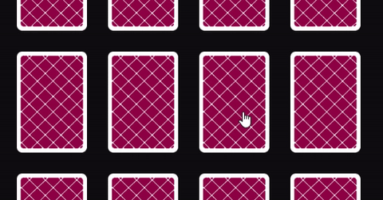

    

# Memoryflip

Memoryflip is a browser based cardflipping game made in Javascript with the help of [pixi.js](http://www.pixijs.com/).

## Play

[Memoryflip](https://rikhartbekkevold.github.io/projects/cardflip-game/index.html)

## Features

Flip the cards to reveal a pattern. Find two equal pairs to match them and remove them from the board. When
all cards are gone the game is over. Try to get the lowest score possible.

- Select number of cards
- Enable for cards to randomly switch position
